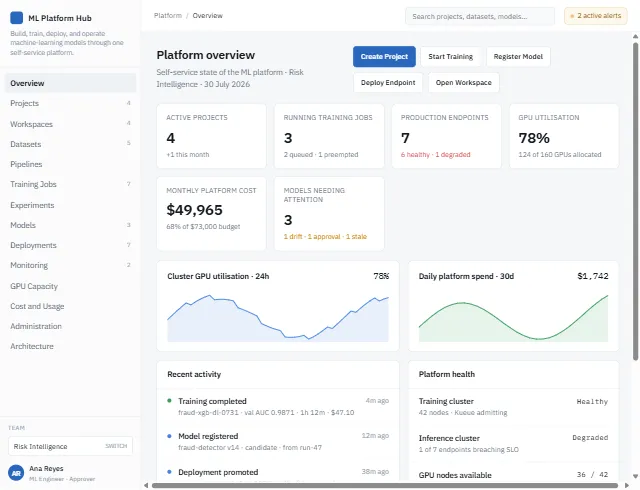

# ML Platform Hub

An interactive front-end prototype for exploring an enterprise machine-learning
platform. It presents operational views for models, deployments, infrastructure,
observability, governance, and platform administration.



## Files

| File | Purpose |
| --- | --- |
| `index.html` | Main prototype page and interface |
| `support.js` | Generated runtime used by the prototype |
| `preview.webp` | Repository and prototype preview image |

## Run locally

No build step or package installation is required. Serve the repository with any
static web server, then open it in a browser.

For example:

```bash
python -m http.server 8000
```

Visit <http://localhost:8000>.

## Notes

- The prototype is intended for demonstration and design review.
- Google Fonts are loaded from the web, so an internet connection is needed for
  the intended typography.
- `support.js` is generated runtime code and should not be edited manually.
